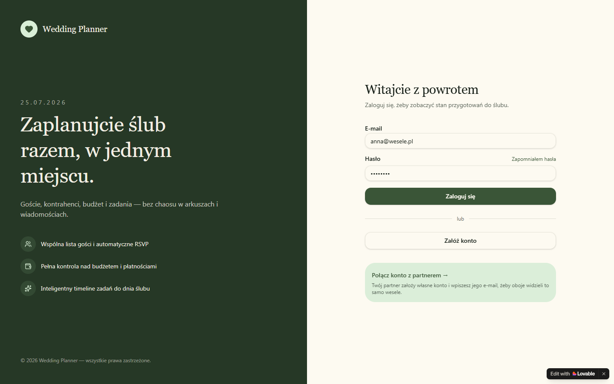
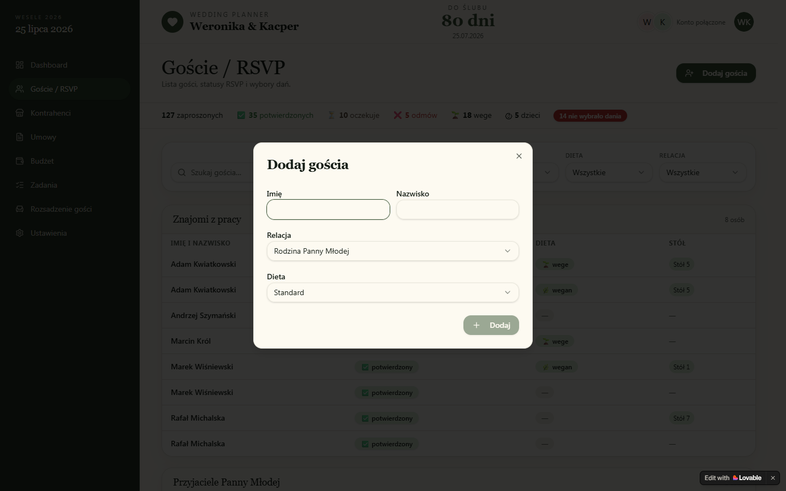

# Overview — Wedding Planner ("Weronika & Kacper")

> **TL;DR**: Polskojęzyczna aplikacja webowa dla pary młodej, agregująca w jednym miejscu wszystko, co dotyczy planowania ślubu — listę gości z RSVP, kontrahentów (sala, catering, fotograf, DJ…), umowy z harmonogramem płatności, budżet, zadania i rozsadzenie gości przy stołach. Konto pary jest "połączone" — oboje partnerzy widzą i edytują to samo wesele.

**Source URL**: https://love-nest-co.lovable.app/
**Reverse-engineered on**: 2026-05-05
**Confidence**: WYSOKA dla UI / NISKA dla backendu — strona to statyczny prototyp Lovable bez prawdziwego API; backend trzeba dorobić w całości.

---

## Purpose & audience

Aplikacja prowadzi narzeczonych przez cały proces przygotowań do ślubu. Adresat: dwoje narzeczonych z dwoma odrębnymi, połączonymi kontami — wspólnie zarządzają jednym weselem. Wartość: zamiast arkuszy Google, rozproszonych chatów i karteczek — pojedyncze źródło prawdy dla gości, kontrahentów, budżetu, zadań i rozsadzenia, z licznikiem dni do ślubu i wskazówkami "co teraz wymaga uwagi".

## Core features

- **Dashboard** ze stanem na dziś — licznik dni do ślubu, 4 kafelki KPI (goście, budżet, najbliższe płatności, zadania), sekcja "Wymaga uwagi" i "Nadchodzące spotkania".
- **Goście / RSVP** — lista gości pogrupowana po relacjach (rodzina/przyjaciele każdej ze stron, znajomi z pracy, wspólni), statusy RSVP, dieta, przypisanie do stołu, agregaty ilościowe na górze.
- **Kontrahenci** — karty dostawców (10 kategorii: Sala, Catering, Fotograf, DJ, Kwiaciarz, USC, Ksiądz, Makijaż, Dekoracje, Tort) z kontaktem, kwotą umowy i statusem (rozważany / spotkanie / zarezerwowany / zapłacony / wykonany). Ostrzeżenie o brakujących kategoriach przy malejącym czasie do ślubu.
- **Umowy** — tabela umów z harmonogramem płatności (zaliczka/raty/final), status, sekcja "Nadchodzące płatności (30 dni)".
- **Budżet** — trzy KPI (wydane / zarezerwowane z umów / estymowana kwota końcowa), 15 kategorii wydatków z paskami postępu vs estymacja.
- **Oferta sali / Catering** *(rozszerzenie poza prototypem, iteracja 3)* — konfigurator menu z pakietu cateringowego: para wprowadza ofertę swojej sali (uniwersalny model — nie pod konkretną firmę), wybiera pakiet cenowy, klika dania w ramach `choice_limit` (np. "8 z 20 pozycji bufetu"), zaznacza dodatki płatne (Pokrowce, Korkowe, Wiejski stół). App liczy końcową kwotę (`pakiet × goście + dodatki`), zasila Budżet jako rezerwację, synchronizuje wybrane warianty dań głównych z RSVP (`meal_options`), i — po akceptacji oferty — może wygenerować umowę z harmonogramem rat.
- **Zadania** — auto-timeline (zadania generowane wstecz od daty ślubu) + zadania własne, pogrupowane na "Opóźnione / W tym tygodniu / W przyszłości"; widoki Lista/Kalendarz.
- **Rozsadzenie gości** — drag-and-drop z lewej kolumny (nieprzypisani) na okrągłe stoły w środku; panel "Konflikty" po prawej.
- **Harmonogram** *(rozszerzenie poza prototypem)* — ankieta dla DJ-a: godzinowy przebieg dnia (lista punktów z szablonem DJ-a + ↑/↓ sortowanie, bez drag-and-drop), pytania logistyczne, dane kontaktowe (menadżer sali, świadkowie, rodzice), szczegóły pierwszego tańca / podziękowań / tortu, preferencje muzyczne (10 kategorii + muzyka per etap) oraz listy must-play (limit 50) / do-not-play. Dane już znane (para, miejsce ceremonii, liczba gości, DJ/sala) są reużywane read-only. Eksport "Wersja dla DJ-a" do druku/PDF (iteracja eksportu).
- **Ustawienia** — profil pary (imiona, data ślubu, miejsce ceremonii), połączone konto partnera, zmiana hasła, eksport danych do JSON. **Dodatek poza prototypem (Recommended)**: sekcja "Menu na wesele" do CRUD opcji dań (par-definiowane, źródło dla dropdownu na ekranie edycji gościa).

## Primary user flows

### Flow 1 — Logowanie i wejście do aplikacji

1. Użytkownik otwiera `/` — split-screen z hero po lewej i formularzem logowania po prawej.
2. Wpisuje e-mail i hasło → klika **Zaloguj się**.
3. UI przekierowuje do `/app` (Dashboard).
4. *W prototypie:* "Zaloguj się" to zwykły link `<a href="/app">` — brak realnego uwierzytelnienia. W produkcyjnej wersji tu wejdzie call do `POST /api/auth/login`.

### Flow 2 — Dodanie nowego gościa

1. Z `/app/goscie` para klika **Dodaj gościa** w prawym górnym rogu.
2. Otwiera się modal z polami: Imię, Nazwisko, Relacja (dropdown), Dieta (dropdown).
3. Klika **Dodaj** → modal się zamyka, gość pojawia się w odpowiedniej grupie tabeli.
4. Agregaty na górze (127 zaproszonych / 35 potwierdzonych / 10 oczekuje / 5 odmów / 18 wege / 5 dzieci) aktualizują się.

### Flow 3 — Sprawdzenie najbliższych płatności

1. Z Dashboardu kafelek "Najbliższe płatności" → klik "Zobacz harmonogram →".
2. Routing prowadzi do `/app/umowy`, gdzie u góry karta **Nadchodzące płatności (30 dni)** wymienia 4 pozycje (kontrahent, typ raty, termin, kwota, "za N dni").
3. Pod spodem tabela wszystkich umów z mini-paskiem statusu rat (kropki kolorowe: opłacone / do zapłaty w 30 dni / po terminie / zaplanowane).

### Flow 5 — Konfiguracja menu z oferty sali *(nowy flow, poza prototypem)*

1. Para otwiera `/app/oferta-sali` po raz pierwszy → pusty stan, przycisk **"Dodaj ofertę"**.
2. Para klika "Dodaj ofertę", wpisuje nazwę ("Pałac Polanka 2026"), opcjonalnie linkuje do kontrahenta z `vendors`. Następnie w `OfferEditor` wprowadza pakiety (Szefa Kuchni 315 zł, Srebrny 339 zł, Złoty 374 zł, Diamentowy 399 zł), kategorie kursów (Obiad/Zupa, Obiad/Danie Główne, …, Bufet zimny `couple_picks` z `choice_limit=8`), bibliotekę dań i dodatki płatne.
3. Para wybiera **Pakiet Złoty** w `PackageTabs`, ustawia `guestCountEstimate = 100`.
4. W każdej `CourseSection` klika dania zgodnie z trybem: w "Zupa" radio — 1 z 5; w "Bufet zimny" checkboxes — 8 z 20 (licznik pokazuje `0/8 → 8/8`).
5. W `AddonsList` zaznacza Pokrowce (`per_person`, 100 szt.), Wiejski stół (`per_event`, 1).
6. `PriceSummary` po prawej pokazuje na żywo: `374 × 100 + 800 + 1500 = 39 100 zł`.
7. Para klika **"Synchronizuj z RSVP"** → backend tworzy `meal_options` z dish_picks dla sekcji w trybie `guest_picks` → na ekranie edycji gościa pojawia się dropdown.
8. Po decyzji o sali para klika **"Zamroź w umowie"** → otwiera się `FreezeContractDialog` (vendor, signedDate, harmonogram rat) → tworzy się `contract` z `total_amount = 39 100` linkujący do `wedding_catering_selection`.
9. Budżet (`/app/budzet`) automatycznie pokazuje `+39 100 zł` w kategorii "Sala weselna" jako `reservedFromContracts`.

### Flow 4 — Rozsadzenie gościa

1. Para wchodzi w `/app/rozsadzenie`.
2. W lewej kolumnie widać listę "Nieprzypisani (10)" z filtrem **tylko potwierdzeni**.
3. Przeciąga gościa kartą na wybrany okrągły stół w środku ekranu (drag-and-drop).
4. Stół aktualizuje "X / 8 miejsc"; statystyka u dołu "25 / 35 gości rozsadzonych" rośnie.
5. Po prawej panel **Konflikty (3)** — pary, których nie należy sadzać razem (powód: były związek / konflikt rodzinny / nie znoszą się).

## Pages discovered

| Path                  | Auth required | Purpose                                                                       | Screenshot                                       |
| --------------------- | ------------- | ----------------------------------------------------------------------------- | ------------------------------------------------ |
| `/`                   | Nie           | Marketing landing + formularz logowania                                       | `screenshots/desktop/01-login.png`               |
| `/app`                | Tak           | Dashboard — KPI + "Wymaga uwagi" + "Nadchodzące spotkania"                    | `screenshots/desktop/02-dashboard.png`           |
| `/app/goscie`         | Tak           | Goście / RSVP — agregaty, filtry, tabela pogrupowana po relacjach             | `screenshots/desktop/03-goscie.png`              |
| `/app/kontrahenci`    | Tak           | Karty kontrahentów + filtry statusu/kategorii + alert braków                  | `screenshots/desktop/04-kontrahenci.png`         |
| `/app/umowy`          | Tak           | Tabela umów + sekcja nadchodzących płatności                                  | `screenshots/desktop/05-umowy.png`               |
| `/app/budzet`         | Tak           | KPI budżetu + 15 kategorii wydatków z paskami postępu                         | `screenshots/desktop/06-budzet.png`              |
| `/app/oferta-sali`    | Tak           | Konfigurator menu z pakietu (pakiety, wybór dań, dodatki, cena końcowa)       | *(brak — nowy ekran poza prototypem; design w `02-frontend.md`)* |
| `/app/zadania`        | Tak           | Lista zadań pogrupowana (Opóźnione / W tym tygodniu / W przyszłości) + auto   | `screenshots/desktop/07-zadania.png`             |
| `/app/rozsadzenie`    | Tak           | Drag-and-drop rozsadzenia gości na 12 okrągłych stołów + panel konfliktów     | `screenshots/desktop/08-rozsadzenie.png`         |
| `/app/harmonogram`    | Tak           | Ankieta DJ-a: przebieg dnia, kontakty, preferencje muzyczne, listy utworów    | *(brak — nowy ekran poza prototypem)*            |
| `/app/ustawienia`     | Tak           | Profil pary, połączone konto, hasło, eksport JSON                             | `screenshots/desktop/09-ustawienia.png`          |

Mobile widoki: `screenshots/mobile/01-login.png`, `02-dashboard.png`, `03-goscie.png`. Sidebar zwija się do dolnej nawigacji (bottom-nav) z ikonami: Dashboard, Goście, Kontrahenci, … (przewijane).

## Out of scope / not investigated

- **Realny backend** — strona to prototyp Lovable; jedyny request poza statycznymi to `POST /~api/analytics` (telemetria Lovable'a). Wszystkie dane są mockami in-memory. Cała warstwa backendu i bazy musi być zaprojektowana od zera (patrz `03-backend.md`, `04-database.md`).
- **Realne logowanie** — link `Zaloguj się` jest zwykłym `<a href="/app">`; brak walidacji, brak tokena. Inferowane: typowy flow JWT, do dorobienia.
- **Upload plików** (skanów umów) — brak w UI, zgodnie z założeniami prototypu.
- **Powiadomienia push / e-mail** — brak; sygnały biznesowe pokazane są wyłącznie jako badge'e i sekcje "Wymaga uwagi" w UI.
- **Rejestracja / "Załóż konto"** — link prowadzi do `#`, formularza nie ma. Inferowane wymaganie: typowa rejestracja (e-mail + hasło + zaproszenie partnera).
- **Eksport JSON** — przycisk obecny, ale brak realnego pobrania.
- **Widok Kalendarz** w Zadaniach — przycisk Kalendarz obecny obok przycisku Lista; nie testowany w recon.
- **Rozwinięcie kategorii budżetu** — chevron przy każdej kategorii sugeruje listę transakcji po rozwinięciu; nie testowane.

## Notes for the implementer

- **Jedno wesele dzielone między dwa konta** to nieoczywista decyzja — model danych musi traktować wesele jako encję pierwszej klasy, do której obaj partnerzy mają **symetryczne** uprawnienia CRUD. Asymetria dotyczy tylko hard-delete'u całego wesela: pole `weddings.created_by_user_id` wskazuje "foundera" — jedyną osobę z RLS-em na `DELETE /weddings/:id`. Patrz `04-database.md`.
- **Auto-timeline zadań**: tagi `auto` przy zadaniach typu "Spotkanie z DJ-em — wybór wykonawcy" sugerują, że system generuje zestaw zadań wstecz od daty ślubu. Zachować — to jeden z kluczowych pomysłów produktowych. Reguły do zapisania jako konfigurowalny seed (templates).
- **Polski UI w 100%** — etykiety, statusy, mock-dane, formaty dat (`DD.MM.YYYY`), kwoty w PLN ze spacją jako separatorem tysięcy (`32 000 zł`).
- **Estetyka**: butelkowa zieleń jako akcent (`#3F5C3A`-ish), kremowe tło (`#FAF7EE`-ish), szeryfowe nagłówki (Cormorant/Playfair) + sans-serif do treści (Inter/DM Sans). Karty z subtelnym cieniem i `rounded-2xl`.
- **Konflikty rozsadzenia** to mała, ale wartościowa funkcja — nie omijać przy MVP, jest mocno widoczna w UI (panel po prawej).
- **Kontrahent vs Umowa**: w UI to dwie osobne sekcje, ale silnie powiązane (każdy kontrahent ma 0 lub 1 umowę, każda umowa ma N płatności). Nie scalać w jeden ekran.
- **Catering konfigurator (poza prototypem)**: model jest **uniwersalny** — para sama wprowadza ofertę swojej sali (CRUD), nie ma globalnej biblioteki ofert. Wzorcem przy projektowaniu była realna oferta (PDF Pałac Polanka 2026 w `docs/menu/`), ale schemat pokrywa dowolne podobne pakiety cateringowe. W v2 można dodać "marketplace szablonów" (publiczne oferty od sal) lub `PdfImportButton` z parsowaniem PDF przez LLM — w MVP wprowadzanie ręczne / kopiowanie z już istniejącego wesela.
