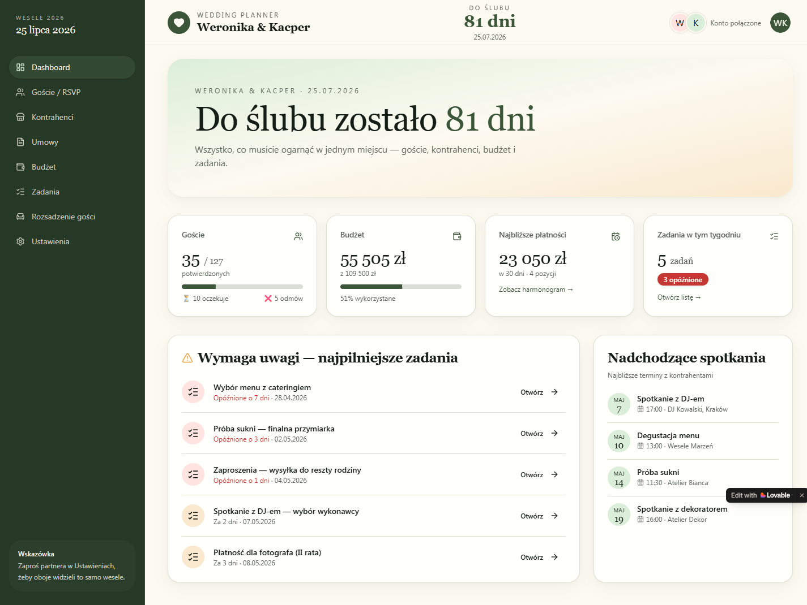
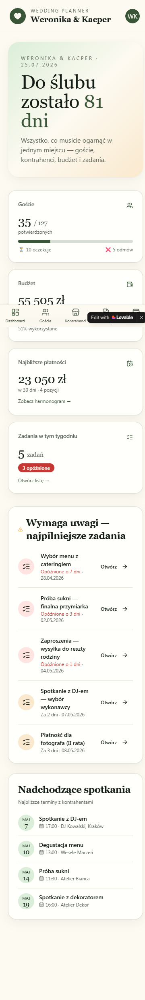

# Frontend — Wedding Planner

> **TL;DR**: SPA z left-sidebar + content layoutem (na mobile sidebar zwija się do bottom-nav). **10 ekranów** pod prefiksem `/app/<slug-pl>` (8 z prototypu Lovable + Catering konfigurator dodany w iteracji 3 + Catering jako sub-sekcja Ustawień). Stylizacja Tailwind + shadcn/ui (kremowe tło, butelkowa zieleń jako akcent, szeryfowe nagłówki, `rounded-2xl`). Stack oryginału: Lovable (React+Vite+Tailwind+shadcn). Stack docelowy do przepisania: **Angular 20+ standalone + signals + SCSS** zgodnie z `CLAUDE.md`.

## Detected stack

| Concern             | Original (Lovable prototype)                                                | Recommended for rebuild       |
| ------------------- | --------------------------------------------------------------------------- | ----------------------------- |
| Framework           | React (przez Lovable runtime `flock.js`)                                    | Angular 20+ standalone        |
| Routing             | SPA, czyste ścieżki `/app/<slug>`, brak page reloadu                        | Angular Router lazy-load      |
| State               | In-memory mocki (brak realnego store'a — to prototyp)                       | Angular signals + services    |
| Styling             | Tailwind utility classes + shadcn-style komponenty (badge, button, dialog)  | Component-scoped SCSS         |
| Forms               | Niewykryte (modal "Dodaj gościa" miał klasyczne inputy)                     | Reactive Forms                |
| HTTP                | Brak — prototyp                                                             | `HttpClient` + interceptors   |

Evidence dla detekcji stacku:
- Brak `window.ng`, `window.__NEXT_DATA__`, `window.__NUXT__`, `window.Vue`.
- Brak `data-reactroot` ani `#root` (pomimo to, wygenerowany kod jest niemal na pewno React+Vite — Lovable buduje React, ale runtime `flock.js` opakowuje root).
- Klasy Tailwind w atrybutach (`bg-primary text-primary-foreground shadow hover:bg-primary/90 h-10 rounded-md px-8`) — typowy ślad shadcn/ui.
- Lovable badge w prawym dolnym rogu z linkiem do `lovable.dev/projects/<uuid>`.
- Brak `meta[name=generator]`, brak innych szczególnych markerów.
- Pojedynczy script: `https://love-nest-co.lovable.app/~flock.js`.

**Wniosek**: oryginał to React+Vite+Tailwind+shadcn opakowany przez Lovable. Do odbudowy w Angularze 20+ wszystko mapuje się 1:1 — Tailwind nie jest wymagany (preferowane SCSS scoped), ale tokeny kolorystyczne i typografia muszą zostać zachowane.

## App shell

Persistent layout dla wszystkich `/app/*`:

- **Left sidebar (≈220px)** — sticky, ciemnozielone tło, zawiera:
  - Header sidebara: "Wesele 2026 / 25 lipca 2026"
  - Nawigacja (8 pozycji, każda z ikoną)
  - Stopka: tip "Zaproś partnera w Ustawieniach…"
- **Top header (banner)** — biały pasek na całą szerokość:
  - Lewo: logo serca + "Wedding Planner / Weronika & Kacper"
  - Środek: licznik **DO ŚLUBU / 81 dni / 25.07.2026**
  - Prawo: dwa kolorowe avatary "W" + "K" + label "Konto połączone" + przycisk avatar "WK"
- **Main content** — scrollowalny, kremowe tło, padding ~32px

Marketing landing (`/`) ma osobny shell — split-screen 50/50: lewa kolumna ciemnozielona z hero/usp, prawa kremowa z formularzem logowania. Brak sidebara, brak headera.

## Routes

| Path                | Page component         | Auth | Notes                                                |
| ------------------- | ---------------------- | ---- | ---------------------------------------------------- |
| `/`                 | `LoginPage`            | Nie  | Split-screen hero + login form                       |
| `/app`              | `DashboardPage`        | Tak  | KPI + Wymaga uwagi + Nadchodzące spotkania           |
| `/app/goscie`       | `GuestsPage`           | Tak  | Lista gości pogrupowana po relacjach                 |
| `/app/kontrahenci`  | `VendorsPage`          | Tak  | Grid 3-kolumnowy kart kontrahentów                   |
| `/app/umowy`        | `ContractsPage`        | Tak  | Tabela umów + sekcja nadchodzących płatności         |
| `/app/budzet`       | `BudgetPage`           | Tak  | KPI + lista kategorii z paskami postępu              |
| `/app/oferta-sali`  | `CateringPage`         | Tak  | Konfigurator menu z pakietu (poza prototypem; nowa funkcja) |
| `/app/zadania`      | `TasksPage`            | Tak  | Toggle Lista/Kalendarz, sekcje wg pilności           |
| `/app/rozsadzenie`  | `SeatingPage`          | Tak  | 3-kolumnowy layout z drag-and-drop                   |
| `/app/ustawienia`   | `SettingsPage`         | Tak  | Profil pary, partner, hasło, eksport                 |

Brak parametryzowanych route'ów w aktualnym prototypie. Rozsądne rozszerzenia w produkcji: `/app/goscie/:id`, `/app/kontrahenci/:id`, `/app/umowy/:id` jako szczegółowe modale lub strony.

## Components

### Layout

- **`AppShell`** — sidebar + header + outlet do contentu, używany dla wszystkich `/app/*`.
- **`MarketingShell`** — split-screen layout dla `/`.
- **`AppSidebar`** — z 9 linkami nawigacyjnymi (Dashboard, Goście, Kontrahenci, Umowy, Budżet, Oferta sali, Zadania, Rozsadzenie, Ustawienia), ikoną przy każdym, podświetla aktywną pozycję ciemniejszym tłem.
- **`MobileBottomNav`** — wariant `AppSidebar` dla `<768px`; sticky na dole, ikony + krótki label, scroll horyzontalny (9 pozycji nie mieści się na 375px).
- **`AppHeader`** — banner z logiem, nazwą pary, licznikiem dni i avatarami partnerów.
- **`CoupleAvatarPair`** — dwa kolorowe kółka z inicjałami partnerów (W, K) + label "Konto połączone". Reusable, np. w Ustawieniach.

### Dashboard

- **`KpiCard`** — kafelek KPI z labelem, dużą liczbą, paskiem postępu i podpisem. Warianty:
  - `GuestsKpi` (pasek + 2 sub-statystyki: oczekuje, odmów)
  - `BudgetKpi` (pasek + procent wykorzystania)
  - `PaymentsKpi` (kwota + N pozycji w 30 dni + link)
  - `TasksKpi` (liczba + badge "N opóźnione")
- **`AttentionList`** — sekcja "Wymaga uwagi" z listą zadań wymagających akcji; każdy item: ikona, tytuł, podtytuł z dni-do-terminu (czerwony jeśli opóźnione), CTA "Otwórz".
- **`UpcomingMeetings`** — pionowa lista nadchodzących spotkań: data (miesiąc + dzień w boxie po lewej), tytuł, godzina i miejsce.
- **`HeroCounter`** — duża szeryfowa fraza "Do ślubu zostało **N dni**" + podpis z imionami i datą.

### Goście / RSVP

- **`GuestsAggregateBar`** — sticky pasek z 7 agregatami: zaproszonych, potwierdzonych, oczekuje, odmów, wege, dzieci, "nie wybrało dania" (badge ostrzegawczy).
- **`GuestSearch`** — input z lupą.
- **`GuestFilters`** — 3 dropdowny: Status RSVP, Dieta, Relacja.
- **`GuestGroupTable`** — sekcja per relacja: header (nazwa relacji, liczba osób) + tabela 4-kolumnowa (Imię i nazwisko, RSVP, Dieta, Stół).
- **`RsvpBadge`** — `potwierdzony` (zielony), `oczekuje` (żółty z ⏳), `odmowa` (czerwony z ❌).
- **`DietBadge`** — 5 wariantów wg `diet` enum z bazy: `pending` (`—` szary, "nie wybrano"), `standard` (neutralny), `vege` 🌱 zielony pastel, `vegan` 🌿 zielony pastel, `gluten_free` 🌾 piaskowy. KPI agregat "wege" w pasku łączy `vege+vegan`.
- **`AddGuestDialog`** — modal z polami: Imię (textbox), Nazwisko (textbox), Relacja (combobox), Dieta (combobox). Przyciski: × (close), + Dodaj. **Tylko 4 pola** — `isChild`, `hasPlusOne`, `mealOptionId`, `tableId`, dane kontaktowe edytuje się dopiero w `EditGuestDialog`.
- **`EditGuestDialog`** — pełny edytor: 4 pola z modala dodawania + `RsvpStatus`, `IsChild` (checkbox), `HasPlusOne` (checkbox), `MealOption` (combobox czytany z `MealOptionsService`, opcjonalny), `TableId` (combobox stołów), `ContactPhone`, `ContactEmail`. Inline-edit w tabeli (klikalne badge'e RSVP/Dieta/Stół) otwiera ten dialog z prefokusem na klikniętym polu — alternatywa: per-cell PATCH bez dialogu (decyzja UX z Open questions).
- **`MealBadge`** — chip z `meal_option.label` (np. "Łosoś z koprem"); `—` gdy `meal_option_id IS NULL`.

### Kontrahenci

- **`VendorAlert`** — żółta karta "Brakujący kontrahenci na N dni przed ślubem" wymieniająca brakujące kategorie.
- **`StatusFilterChips`** — chips filtrowania po statusie umowy (Wszystkie statusy / rozważany / spotkanie / zarezerwowany / zapłacony / wykonany).
- **`CategoryFilterChips`** — chips filtrowania po kategorii (Wszystkie kategorie / DJ / Fotograf / Catering / Kwiaciarz / Sala / USC / Ksiądz / Makijaż / Dekoracje / Tort).
- **`VendorCard`** — karta z: ikoną kategorii (po lewej), label kategorii (uppercase), nazwą firmy (szeryfowy), badge statusu (pastel), nazwiskiem osoby kontaktowej, telefonem, e-mailem, kwotą umowy, dwoma przyciskami "Edytuj" / "Zobacz umowę".
- **`VendorAddCard`** — karta z `+` i napisem "Dodaj kontrahenta", placeholder na koniec siatki.
- **`StatusBadge`** (wspólny) — kolory wg statusu, używany też w Umowach.

### Umowy

- **`UpcomingPaymentsCard`** — karta z listą 4 nadchodzących płatności: kontrahent, typ (rata/zaliczka/final/ofiara) + data, badge "za N dni" (czerwony gdy ≤ 7 dni), kwota.
- **`ContractsTable`** — kolumny: Kontrahent, Kategoria, Kwota, Harmonogram płatności (mini-pasek `PaymentDots`), Podpisana, Status.
- **`PaymentDots`** — wizualny pasek statusu rat: kropki kolorowe (🟢 opłacone / 🟡 do zapłaty w 30 dni / 🔴 po terminie / ⚪ zaplanowane) + ułamek "X/Y".
- **`ContractStatusBadge`** — `w trakcie`, `zaliczka opłacona`, `opłacone w całości`, `—` (brak płatności).
- **`PaymentLegend`** — tekst z legendą kolorów kropek.

### Budżet

- **`BudgetSummary`** — 3 duże liczby w rzędzie: WYDANE, ZAREZERWOWANE (UMOWY), ESTYMOWANA KWOTA KOŃCOWA + podpis "Suma do dziś (wydane + zarezerwowane): … · estymacja końcowa to suma estymowanych kwot dla wszystkich kategorii."
- **`BudgetCategoryRow`** — wiersz z: chevron rozwijający, nazwa kategorii, prawa strona "X zł wydane · est. Y zł", pasek postępu kolorowy (zielony do 70%, żółty 70-90%, czerwony >90%), podpis "N% estymowanej kwoty".
- **`AddExpenseDialog`** (inferowany) — modal "Dodaj wydatek": kategoria (combobox), kwota, data, opis.
- **`EditCategoryPlanDialog`** (inferowany) — modal "Edytuj plan": lista kategorii z polami estymowanej kwoty.

### Oferta sali / Catering *(nowy ekran, poza prototypem)*

`CateringPage` to konfigurator menu z pakietu cateringowego sali. Para wprowadza ofertę raz (z PDFa od sali), wybiera pakiet, klika dania w `choice_limit`, dorzuca dodatki. App liczy końcową kwotę i synchronizuje z RSVP.

- **`CateringPage`** — kontener strony. Trzy stany:
  1. **Empty state** — para nie ma ofert: hero "Dodaj ofertę swojej sali" + przycisk "Importuj ofertę" / "Wprowadź ręcznie".
  2. **Lista ofert** — gdy >1 oferta (porównywarka): cards z packages collapsed, "Wybierz tę ofertę".
  3. **Aktywna oferta + selection** — pełen konfigurator (pakiety, courses, dishes, addons, price summary).
- **`OfferHeader`** — nazwa oferty, data ważności, link do vendora (sala / catering), przyciski Edytuj/Usuń.
- **`PackageTabs`** — taby z pakietami w ofercie (Szefa Kuchni / Srebrny / Złoty / Diamentowy); aktywny tab to ten wybrany w `wedding_catering_selection`. Zmiana taba pokazuje "Zmienić pakiet?" confirm (bo wyczyści wszystkie picks).
- **`PackagePriceCard`** — duża cena per osoba, badge `is_modifiable` ("Menu nie podlega modyfikacjom" gdy false), pole `guest_count_estimate` z stepperem.
- **`CourseSection`** — jedna sekcja w pakiecie (np. "I Kolacja"). Header: ikona (z `course_type`), tytuł, podtytuł "Wybierz {choiceLimit} z {available.length}" lub "Serwowane wszystkim" (`all_served`) lub "Każdy gość wybiera 1 z {available.length}" (`guest_picks`).
- **`DishPickList`** — lista dań w sekcji. Zachowanie zależy od `selection_mode`:
  - `all_served` — read-only lista (wszystkie dania serwowane).
  - `couple_picks` z `choice_limit=1` — radio buttons (single select).
  - `couple_picks` z `choice_limit>1` — checkboxes z licznikiem "{picked}/{choice_limit}"; przy próbie zaznaczenia gdy limit wyczerpany — toast "Już wybrałaś {N} pozycji".
  - `guest_picks` — checkboxes (para wybiera "warianty" do zaprezentowania gościom; gość potem wybierze 1 w RSVP).
- **`DishCard`** — wiersz: nazwa dania, ikony 🌱 (vegetarian) / 🌿 (vegan) / 🌾 (gluten_free) / ⚠️ z tooltipem alergenów, opis collapsed.
- **`AddonsList`** — lista dodatków płatnych z checkbox + (gdy zaznaczone) input `quantity`. Każdy dodatek pokazuje cenę z jednostką ("8 zł / os.", "1500 zł / impreza", "25 zł / butelka").
- **`PriceSummary`** — sticky karta po prawej (desktop) / sticky bottom (mobile): pakiet × N gości + Σ(addons), z listą rozbicia. Przyciski:
  - **"Synchronizuj z RSVP"** — wywołuje `POST /catering/selection/sync-meal-options`. Pokazuje toast "Utworzono {N} opcji do wyboru przez gości".
  - **"Zamroź w umowie"** — otwiera `FreezeContractDialog` (wybór vendora, harmonogram płatności).
- **`FreezeContractDialog`** — modal: vendor combobox (filtered to category=sala/catering), pole `signedDate`, dynamiczna lista płatności (zaliczka/raty/final), preview total = computed price. Submit → `POST /catering/selection/freeze-into-contract`.
- **`OfferEditor`** — modal/page do CRUD oferty (zaawansowane, dla kogoś kto wprowadza ofertę z PDFa):
  - 4 zakładki: Pakiety / Kategorie / Dania / Dodatki
  - Każda z bulk-import (textarea: po 1 pozycji w linii) + drag-handle do `sortOrder` + inline edit
  - Zakładka "Kategorie" pozwala zlinkować wiele dań do jednej kategorii (multi-select)
- **`PdfImportButton`** *(opcjonalne, v2)* — przycisk "Importuj z PDF": upload PDF → backend wywołuje LLM (Claude/Gemini) → parsuje strukturę pakietów/dań/dodatków → preview do akceptacji → bulk insert. **Poza MVP** — w MVP CRUD ręczny.

### Zadania

- **`TasksViewToggle`** — przełącznik Lista / Kalendarz.
- **`TaskGroupSection`** — sekcja kolorowana wg pilności: Opóźnione (różowe tło), W tym tygodniu (jasnożółte), W przyszłości (jasnofiolet/szare); header z emoji, tytułem, liczbą zadań.
- **`TaskRow`** — checkbox, tytuł, data + dni do terminu (czerwone gdy po), badge kategorii (strój/kontrahent/goście/formalności/inne), badge `auto` (gdy wygenerowane z timeline'u).
- **`AddTaskDialog`** — modal "Dodaj zadanie" (inferowane pola: tytuł, kategoria, deadline, opis).
- **`TasksCalendarView`** (inferowany) — miesięczny grid z kropkami przy dniach z zadaniami; klik dnia → boczny panel.

### Rozsadzenie

- **`UnassignedGuestsList`** — lewa kolumna ~250px: header "Nieprzypisani (N)", checkbox "tylko potwierdzeni", lista kart `UnassignedGuestCard` z drag-handle.
- **`UnassignedGuestCard`** — imię i nazwisko + ikony 💑 (+1) / 👶 (dziecko) / 🌱/🌿/🌾 (dieta).
- **`SeatingCanvas`** — środkowy obszar: grid 2-kolumnowy okrągłych stołów; toolbar nad nim z liczbą stołów, miejscami per stół (zmiana globalna), przyciskiem "Dodaj stół".
- **`RoundTable`** — okrągły zielony placeholder ze stołem (number labels po obwodzie z inicjałami przypisanych gości), label "Stół N" w środku, podpis "X / Y miejsc" na dole; drop target dla drag-and-drop.
- **`ConflictsPanel`** — prawa kolumna ~250px: header "Konflikty (N)", lista par konfliktowych z imionami i powodem.
- **`SeatingStats`** — pasek u dołu: "Statystyki rozsadzenia: X / Y gości rozsadzonych".

### Ustawienia

- **`CoupleProfileForm`** — formularz "Profil pary": Imię partnerki (textbox), Imię partnera (textbox), Data ślubu (date picker, obok zielony badge "Do ślubu: 81 dni"), Miejsce ceremonii (textbox). Przycisk "Zapisz zmiany". Przy zmianie daty otwiera dialog "Zadania auto przesuną się o N dni — kontynuować?" (trigger PG zrobi to atomowo, dialog tylko ostrzega).
- **`MealOptionsCard`** *(nowy, poza prototypem — Recommended)* — sekcja "Menu na wesele": lista par-zdefiniowanych opcji dań (`label` + drag-handle do `sortOrder`), przyciski Add/Edit/Delete inline. Zasila `EditGuestDialog > MealOption` dropdown. CRUD przez `MealOptionsService`.
- **`LinkedAccountCard`** — sekcja "Połączone konto": karta z avatarem partnera (inicjał), imię i nazwisko partnera, e-mail, badge "Połączone". Przycisk "Wyślij zaproszenie ponownie". **Founder** (czyli user z `id === wedding.createdByUserId`) widzi dodatkowo czerwony przycisk "Usuń wesele" z double-confirm — `DELETE /api/weddings/:id`.
- **`SecuritySection`** — Aktualne hasło + Nowe hasło inputy, przycisk "Zmień hasło", link "Wyloguj ze wszystkich urządzeń" (czerwony).
- **`DataExportSection`** — opis + przycisk "Pobierz JSON". Endpoint zwraca pełen dump bez secrets (`password_hash`, invitation `token`).

### Shared / primitive

- **`Button`** — warianty `primary` (zielone wypełnione), `secondary` (kremowe z borderem), `ghost`, `danger` (czerwony tekst). Rozmiary `sm`/`md`/`lg`.
- **`Badge`** — pastelowe tła wg semantyki (status RSVP, dieta, kategoria zadania, status umowy, status kontrahenta).
- **`Dialog`** — modal z overlay, headerem, contentem, przyciskiem zamknięcia "×".
- **`Combobox`** — dropdown z kontrolką "Wszystkie" jako default.
- **`ProgressBar`** — pasek postępu, kolor wg progu (zielony/żółty/czerwony/szary).
- **`InputText`**, **`InputDate`**, **`InputPassword`** — z labelami nad polem.
- **`PageHeader`** — duży szeryfowy h1 + szary podtytuł + opcjonalny przycisk akcji po prawej.

## State

### Local (component)

- Stan filtrów na liście Goście (status, dieta, relacja, search query) — komponent.
- Stan otwartych modali (`AddGuestDialog` open/close, `AddTaskDialog` open/close itd.) — komponent rodzic listy.
- Stan rozwiniętych wierszy w `BudgetCategoryRow` — sygnał per kategoria.
- Stan toggle Lista/Kalendarz w Zadaniach — komponent.
- Stan checkbox "tylko potwierdzeni" w `UnassignedGuestsList` — komponent.

### Shared / global (services with signals)

| State slice              | Service                  | Source                                                        |
| ------------------------ | ------------------------ | ------------------------------------------------------------- |
| Bieżąca para / wesele    | `WeddingService`         | `GET /api/me/wedding` (po loginie); zawiera datę ślubu i partnerów |
| Aktualny user            | `AuthService`            | `GET /api/me`; signal `user`                                  |
| Goście                   | `GuestsService`          | `GET /api/wedding/<id>/guests`                                |
| Kontrahenci              | `VendorsService`         | `GET /api/wedding/<id>/vendors`                               |
| Umowy + płatności        | `ContractsService`       | `GET /api/wedding/<id>/contracts` (z włączonymi płatnościami) |
| Budżet                   | `BudgetService`          | `GET /api/wedding/<id>/budget` (kategorie + transakcje)       |
| Zadania                  | `TasksService`           | `GET /api/wedding/<id>/tasks`                                 |
| Stoły + rozsadzenie      | `SeatingService`         | `GET /api/wedding/<id>/tables`, `…/conflicts`                 |
| Oferta sali (offers + selection) | `CateringService` | `GET /api/wedding/<id>/catering/offers`, `…/selection`, `…/selection/price` |
| Powiadomienia (toasty)   | `ToastService`           | Lokalna kolejka                                               |

Wszystkie service'y przechowują dane jako `signal<T>` i wystawiają `computed()` dla derywatów (np. `confirmedGuestsCount`, `daysUntilWedding`, `attentionItems`).

### Server cache

W oryginalnym prototypie nie ma cache'a (mocki in-memory). W rebuildzie: signal-driven pull-on-mount strategia jest wystarczająca; rozważyć `tanstack/angular-query` dopiero gdy listy zaczną się powtarzać między ekranami w sposób uciążliwy dla UX (na razie nie).

## Forms

### `LoginForm`

| Field    | Type    | Validation                       |
| -------- | ------- | -------------------------------- |
| email    | email   | required, RFC-valid              |
| password | password| required, min 8                  |

- Submit: `POST /api/auth/login` (do dorobienia — w prototypie tylko link)
- Success: store token; redirect do `/app`
- Failure: toast "Nieprawidłowy e-mail lub hasło"

### `AddGuestDialog`

| Field      | Type    | Validation                                    | Default                |
| ---------- | ------- | --------------------------------------------- | ---------------------- |
| firstName  | text    | required, max 60                              |                        |
| lastName   | text    | required, max 80                              |                        |
| relation   | select  | required; opcje z enum'a relacji              | "Rodzina Panny Młodej" |
| diet       | select  | required; opcje: Standard / wege / wegan / bezglutenowa | "Standard"  |

- Submit: `POST /api/wedding/<id>/guests`
- Success: zamknij modal, dodaj do listy, podbij agregaty.

### `CoupleProfileForm`

| Field            | Type    | Validation                          |
| ---------------- | ------- | ----------------------------------- |
| partnerAName     | text    | required                            |
| partnerBName     | text    | required                            |
| weddingDate      | date    | required, future                    |
| ceremonyLocation | text    | required                            |

- Submit: `PATCH /api/wedding/<id>` (bezpieczna autoryzacja: tylko partnerzy tego wesela).

### `ChangePasswordForm`

| Field           | Type     | Validation                          |
| --------------- | -------- | ----------------------------------- |
| currentPassword | password | required                            |
| newPassword     | password | required, min 8, ≠ aktualne         |

### Inferowane formularze (nieotwarte w recon, ale konieczne)

- `AddVendorForm` — kategoria, nazwa firmy, osoba kontaktowa, telefon, e-mail, kwota umowy (opcjonalna), status.
- `AddContractForm` — kontrahent (combobox), data podpisania, kwota całkowita, harmonogram płatności (lista wierszy: typ + termin + kwota).
- `AddPaymentForm` — kontrahent/umowa, typ raty, termin, kwota, status.
- `AddExpenseForm` — kategoria, data, opis, kwota.
- `EditCategoryPlanForm` — lista kategorii z polami estymowanej kwoty.
- `AddTaskForm` — tytuł, kategoria (strój/kontrahent/goście/formalności/inne), deadline, opis.
- `AddTableForm` — nazwa stołu, liczba miejsc.
- `LinkPartnerForm` — e-mail partnera; wysyła zaproszenie.

## Responsive behavior

| Viewport       | Behavior                                                                       |
| -------------- | ------------------------------------------------------------------------------ |
| ≥1024px        | Sidebar widoczny stale, header z licznikiem, grid 3-kolumnowy kart, tabele full-width |
| 768–1023px     | Sidebar collapsuje się do węższej kolumny ikon (do uściślenia w designie)      |
| <768px         | Sidebar znika, na dole **bottom-nav** z ikonami; header bez licznika dni; karty 1-kolumnowe; tabele scrollują horyzontalnie; agregaty na Goście wrapują się do 2 linii |

Screenshots:
- `screenshots/mobile/01-login.png` — formularz logowania na pełną szerokość
- `screenshots/mobile/02-dashboard.png` — KPI ułożone w jedną kolumnę, bottom-nav widoczny
- `screenshots/mobile/03-goscie.png` — agregaty wrapują, filtry stack pionowo, sticky bottom-nav

## Accessibility observations

- Wszystkie linki nawigacyjne mają wyraźne etykiety tekstowe (nie tylko ikony).
- Formularze mają labele nad inputami.
- Modal "Dodaj gościa" ma `role="dialog"` (potwierdzone w DOM).
- Brak widocznych ARIA-live regions dla aktualizacji licznika dni / agregatów — do dodania w rebuildzie.
- Kontrast tekstu na kremowym tle wygląda OK; pastelowe badge'e mogą wymagać sprawdzenia (zwłaszcza żółte na białym).
- Drag-and-drop na rozsadzeniu **musi** mieć alternatywę klawiaturową w produkcji.

## Inferred but unverified

- **Routing podstron szczegółów** (np. `/app/goscie/:id`) — w prototypie nie ma; należy zdecydować czy szczegóły idą w modal czy osobny route.
- **Widok kalendarza w Zadaniach** — przycisk obecny, ale nie testowany w recon.
- **Mechanika drag-and-drop** w rozsadzeniu — wizualnie udokumentowana, technicznie nieprzetestowana (animacje, snap-to-seat, walidacja konfliktów w locie).
- **Inline edycja** w tabeli gości (status RSVP, wybór dania, przypisanie do stołu) — sugerowana przez prompt-prototyp-ui.md, ale w aktualnym prototypie kolumny nie wyglądają na edytowalne in-place; do potwierdzenia z designerem.
- **Toasty / notyfikacje** — nie zaobserwowane w recon (akcje nie były odpalane realnie). Standard: bottom-right, auto-dismiss 4s.
- **Empty states** — nie widzieliśmy żadnego ekranu pustego (mocki wszędzie pełne); do zaprojektowania per ekran (Goście, Kontrahenci, Zadania).
